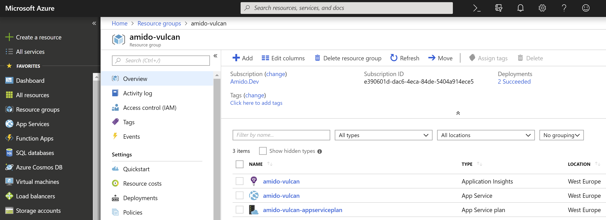
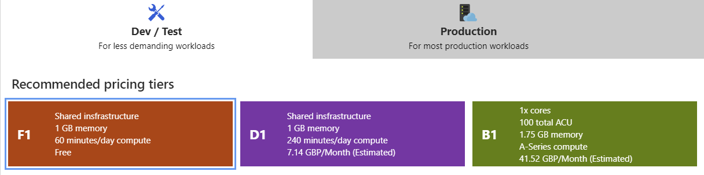
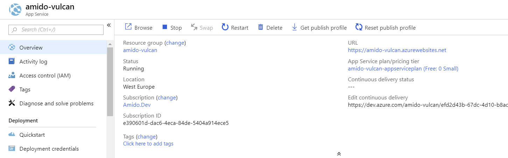
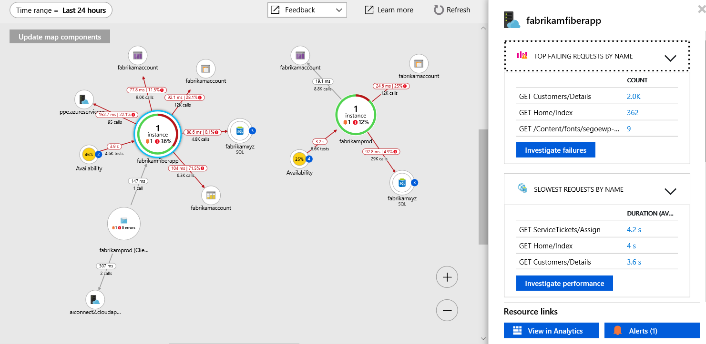

The [Azure Portal](https://portal.azure.com) is a daunting interface to the multitude of services to be managed on the cloud platform. Initially at least, we will only need a few items to get going.

## Resource Group

Azure resource groups allow you to easily bundle and manage services together. Typically, you would create a resource group for each client or project so that you can manage things like resource costs and compliance policies. Common application setups can be templated and deployed as code via ARM (Application Resource Manager) templates.

---

## App Service Plan

The App Service Plan sets out the Azure compute resources (and associated costs) that will be used by the App Service. There are different offerings for Linux and Windows OS platforms and plans can be shared accross a number of services. Higher tier plans have more flexibility for scaling up and out with available resources.

Vulcan is using the development F1 tier Windows service. This uses shared resources and gives us just the basics needed to play around with.

---

## App Service

The App Service is Azure's catch all for hosted applications. App hosting configuration, deployment and monitoring are just some of the features available in the portal.

This is the final required piece for Vulcan as we need to let DevOps know where to publish to in the Release stage. Vulcan currently consists of a single Web App simply configured to be in Europe - no further setup required!

---

## App Insights

Whilst not required, App Insights offers amazing logging and performance information that, depending on the app, allows for tracing right through the technology stack from UI interaction to DB query.

This has been added to Vulcan but has yet to be configured.

---

